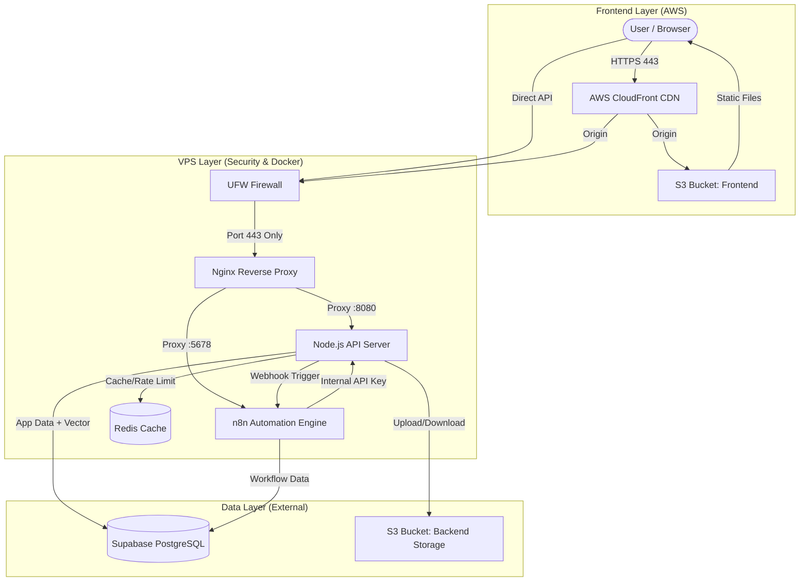

# Arsitektur Sistem Siedu (Secure Hybrid Cloud)

Dokumen ini menjelaskan arsitektur "Hybrid Cloud" yang digunakan untuk menyeimbangkan performa tinggi, efisiensi biaya, dan **keamanan berlapis** pada VPS spesifikasi terbatas (2 Core / 2GB RAM).

## Diagram Arsitektur

## Komponen Utama

### 1. Frontend (AWS CloudFront + S3)
- **Konsep**: Serverless. Tidak memakan resource VPS sama sekali.
- **Fungsi**: Menyajikan UI Dashboard (React) ke user dengan kecepatan tinggi via CDN global.
- **Biaya**: Sangat murah (AWS Free Tier).

### 2. VPS Layer (Compute & Security)
- **Spesifikasi**: 2 vCPU, 2GB RAM (Singapore).
- **Security Layer (7 Layers)**:
  1. **UFW Firewall**: Whitelist Port 22, 80, 443. Block others.
  2. **Nginx Reverse Proxy**: Single entry point, SSL Termination (Let's Encrypt).
  3. **Security Headers**: HSTS, XSS protection, anti-clickjacking.
  4. **Rate Limiting**: Mencegah DDoS/Brute-force (API: 10r/s, n8n: 5r/s).
  5. **Fail2ban**: Auto-ban IP yang melakukan brute-force SSH atau spam request.
  6. **SSL/TLS**: Enkripsi penuh (A+ Grade).
  7. **File Blocking**: Memblokir akses ke file sensitif (.env, .git).

- **Application Layer**:
  - **API Server**: Node.js Express, stateless.
  - **n8n**: Workflow automation engine.
  - **Redis**: In-memory cache.

### 3. Data Layer (Supabase + AWS S3)
- **Supabase (PostgreSQL)**:
  - Menyimpan data User, Bot, Chat History.
  - Menyimpan data internal n8n (workflow executions).
  - Menyimpan **Vector Embeddings** (Kecerdasan Buatan) untuk RAG.
- **AWS S3 Backend**:
  - **Single Bucket**: `chat-backend-storage`.
  - **Prefixes**: `media/` (chat images, 30-day lifecycle), root (KB docs).

## Alur Data (Flow)

1. **User Login**: Frontend mengirim request ke `api.siedu.web.id` → Nginx → API → Cek Supabase.
2. **User Upload**: API menerima file → Upload ke S3 Backend → Simpan URL di Supabase.
3. **Chat Masuk**: API terima pesan → Kirim ke n8n → n8n baca Context (Supabase Vector) → LLM → Balas ke API.

## Keuntungan Skema Ini
1. **Security-First**: Dengan Nginx + UFW + Fail2ban, server aman dari serangan dasar.
2. **VPS Lega**: RAM 2GB sepenuhnya milik n8n dan API. Database tidak akan membuat server crash.
3. **Stateless**: VPS bisa diganti kapan saja tanpa kehilangan data (karena data di Supabase & S3).
